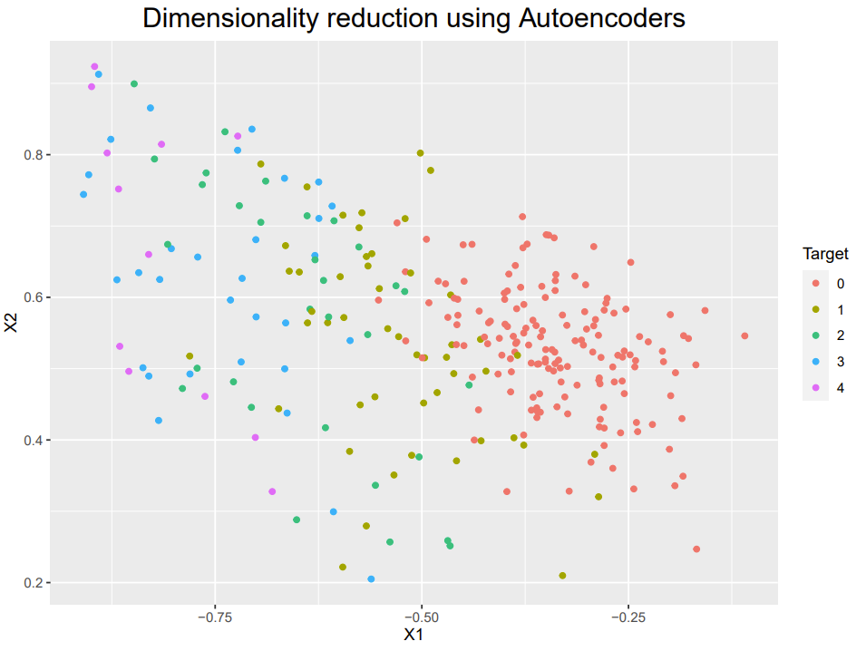

Repo: <https://github.com/HuberNicolas/heart-disease>

About the project

Python Version: 3.8.5 (64-bit)

R Version: 4.0.4 (64-bit)

  Name of the folder                  Description
  ----------------------------------- ---------------------------------------------------------------------------------------------------------------------------------------------
  0 raw .data                         Contains the raw data (incl. .md5 hashes) from the [source](https://archive.ics.uci.edu/ml/machine-learning-databases/heart-disease/).
  1 raw .csv                          Contains the renamed .csv files and the formatter script (incl. .md5 hashes).
  2 formatted .csv                    Contains the formatted .csv files without a header (incl. .md5 hashes).
  data                                Contains the datasets (incl. header) the analysis was run (incl. .md5 hashes).
  logs                                Contains the logfiles of the scripts.
  plots                               Contains the plots that were generated during the analysis.
  rand_forest_feature_selection(25)   Contains the datasets (incl. header) after the random forest selection. These sets contain 25 features, that can "explain" 80% of the data.

About the datasets

The following explanations are based on the heart-disease.NAMES file.

**\# of Instances:**

-   Cleveland: 303

-   Hungarian: 294

-   Switzerland: 123

-   Long Beach VA: 200

**Number of Attributes:** 76 (including the predicted attribute) See
appendix for the complete list. (Missing Attribute Values: Several.
Distinguished with value -9.0.)

"This database contains 76 attributes, but all published experiments
refer to using a subset of 14 of them. In particular, the Cleveland
database is the only one that has been used by ML researchers to this
date."

**Class distribution:** (Classtype (domain \[0,4\]) is referring to
feature 58 "num", diagnosis of heart disease (angiographic disease
status). This indicates, how severe the disease is (0: no disease, 4:
most severe disease)

  Database         Class = 0   Class = 1   Class = 2   Class = 3   Class = 4   Total
  ---------------- ----------- ----------- ----------- ----------- ----------- -------
  Cleveland        164         55          36          35          13          303
  Hungarian        188         37          26          28          15          294
  Switzerland      8           48          32          30          5           123
  Long Beach VA:   51          56          41          42          10          200

Description of the process-pipeline

**General:**

Note: For this data science project, only the following. data files
were used:

  Filename             Md5-Hash
  -------------------- ----------------------------------
  cleveland.data       2388e97e27676171aa0a1c61bb4a3670
  hungarian.data       ce4a62b8de90d93d616ede3253239851
  long-beach-va.data   381cee4b51b786623402929e2cc1ccf9
  switzerland.data     b2a3e9cc9c82dc0f8fa19bb851db495d

These .data files were **not** used:

  Filename                     Md5-Hash
  ---------------------------- ----------------------------------
  new.data                     046bd9f619c20148b261b3e392c02591
  processed.cleveland.data     2d91a8ff69cfd9616aa47b59d6f843db
  processed.hungarian.data     22e96bee155b5973568101c93b3705f6
  processed.switzerland.data   9a87f7577310b3917730d06ba9349e20
  processed.va.data            4249d03ca7711e84f4444768c9426170
  reprocessed.hungarian        3698a53d41cccc2e4499e1273c055378

For the sake of completeness, nonetheless, we did include the whole
folder.

Preparing the datasets:

First step: rename .data files (0 raw .data) to .csv (1 raw .csv).

Second step: format the .csv files via python script "formatter" (2
formatted .csv). This step was needed because the original data was
badly formatted. The formatter.py formats the datasets, such that all
features of one patient are one row and not scattered over multiple
rows.

Third step: adding a header for the 76 features (data).

We finally get 4 files in our data folder:

  Filename                      Md5-Hash
  ----------------------------- ----------------------------------
  cleveland_76_header.csv       a67792681f83998d97e332bfb41efee0
  hungarian_76_header.csv       6c86829818559cfb434126c61d5cb25c
  long-beach-va_76_header.csv   4dde4782acbbdac7b2198bb676fea13f
  switzerland_76_header.csv     d4a1d37007107ee2fb73be8a4122bf32

Important note: At this moment, no entries were modified.

**Process of Visualization and Analyse**

The processing of the data was done in the following order.
Pre-processing and (general) visualization, feature selection,
reduction, and finally classification. We focus and start in this
project on working with the whole dataset and not the already
pre-processed files, which only include a tiny subset of the features,
to finally compare the locations with each other.

It is in general a good idea to start with some visualizations get a
rough overview and kind of an intuition of the (abstract) data. In a
second step doing a feature, the selection is crucial, because 76
features go beyond the constraints of reasonable analysis. Using the
RandomForestClassifier found 25 features that have the most impact on
the data. The two other approaches were t-SNE and UMAP and in addition
to this using autoencoders with R. Several different classification
algorithms, namely

-   Logistic Regression

-   Naïve Bayes

-   SVM (linear, poly (degree = 3) and kernel (rbf))

-   KNN (nn = 5)

-   Neural Networks

-   Autoencoders (in R)

were processed before finally a conclusion was drawn from the results
and plots.

Disclaimer:

-   The Swiss dataset was highly unbalanced (very few 0's and 4's in the
    "num" section which is they-feature). That causes the ROC-score to
    struggle.

-   In addition to this, the Swiss dataset has no information about the
    chol level (default 0). That means it was not possible to plot the
    second scatter plot.

-   Overall, the Swiss data set was not very suitable for this kind of
    analysis. The above-mentioned difficulties were (amongst other
    things) for the low model accuracy.

In the following, there is a summary of all the different plots, how
they were generated, and which technique/method/model was used.

I.  **PREPROCESSING & DATA VISUALIZATION**

1.  Visualize Max heart rate vs age with the target variable "num" (1-4)
    : Scatter Plot

2.  Visualize cholesterol level vs age with the target variable "num"
    (1-4) : Scatter Plot

3.  Visualize blood pressure vs chest pain : Box Plot

4.  Visualize correlation between features and target variable "num"
    (1-4) : Bar Plot (.corrwith)

5.  Visualize correlation between features and target variable "num"
    (1-4) : Heatmap (.corr)

6.  Visualize blood pressure vs age with the target variable : LMplot
    (.lmplot : scatterplot with an optional overlaid regression line)

7.  Visualize heart rate vs age with the target variable : LMplot
    (.lmplot : scatterplot with an optional overlaid regression line)

8.  Visualize distribution of age according to the presence of heart
    disease : KDEplot (.kdeplot : represents the data using a continuous
    probability density curve)

9.  Visualize comparison between the distribution of the disease
    according to age and sex : Bar Plot (.groupby)

II. **FEATURE SELECTION**

10. Visualize feature importance : Bar Plot (RandomForestClassifier) =\>
    saved under / rand_forest_feature_selection(25)

III. **REDUCTION & VISUALISATION**

11. Visualize feature reduction for different perplexities : Scatter
    Plot (TSNE)

12. Visualize feature reduction : Scatter Plot (UMAP)

IV. **CLASSIFICATION**

13. Visualize logistic regression : Heatmap (LogisticRegression)

14. Visualize performance of logistic regression : ROC plot + AUC result
    ; Print accuracy : (metrices.accuracy_score)

15. Visualize naïve Bayes : Heatmap (GaussianNB)

16. Visualize performance of naïve Bayes : ROC plot + AUC result ; Print
    accuracy : (metrices.roc_auc_score)

17. Visualize performance of SVM (linear kernel) : ROC plot + AUC result
    ; Print accuracy : (metrices.accuracy_score)

18. Visualize performance of SVM (poly (d=3) kernel) : ROC plot + AUC
    result ; Print accuracy : (metrices.accuracy_score)

19. Visualize performance of SVM (rbf kernel) : ROC plot + AUC result ;
    Print accuracy : (metrices.accuracy_score)

20. Visualize SVM (linear, poly (d=3) and rbf kernel) : Heatmap
    (svm.SVC(kernel = TYPE))

21. Visualize KNN : KNeighborsClassifier(n_neighbors = 5, algo =
    "ball_tree") ; Print accuracy : (accuracy_score)

22. Visualize performance of KNN : ROC + plot ; Print cross validation :
    (cross_val_score)

23. Visualize performance of simple neural Network : model =
    Sequential(), model.fit()

V.  **ACCURACIES**

Above is a summary of the scripts (and their log-files) of the accuracy
in the form of a table. X is dependent on the associated method (first
column) for instance using logistic regression, X_pred is named
LR_pred).

VI. **AUTOENCODERS**

**Cleveland analysis**

-   Feature selection (first five most important)

Laddist -- "distal left anterior descending artery" seems to be one of
the most important features. Indeed, it is part of the left main
coronary artery (LAD), considered the most important because it supplies
more than half of the blood to the heart.

Thal -- "exercise thallium scintigaphy" is a diagnostic method of
nuclear medicine that enables visualization of well-perfused and vital
tissue of myocardium by means of 201thallium absorbed by its cells. This
method is used to evaluate the character of soft tissue lesions. The
feature is divided into three categories from normal to defect.

Om1 -- "first obtuse marginal branch" is also an important vessel that
is part of the left main coronary artery (LAD).

Ca -- "number of major vessels".

Rcaprox -- "proximal right coronary artery" is part of the right
coronary artery (RCA) in contrast to LAD.

-   Autoencoders

**Hungary analysis**

-   Feature selection (first five most important)

Cp -- "chest pain" seems to be selected as the most important feature.
It is divided into four categories: type: 1 = typical angina; 2 =
atypical angina; 3 = non-angina pain; 4 = asymptomatic.

Painexer -- "pain provoked by exertion". It is divided into two
categories: 1 if the patient felt pain during effort, 0 otherwise.

Oldpeak -- "exercise-induced ST depression relative to rest" is an
exercise electrocardiography test to evaluate whether the trace in the
ST segment is abnormally low below the baseline which is often a sign of
myocardial ischemia.

Lvx4 -- not used / not described / no information regarding this
feature.

Exang -- "Exercise-induced angina". It is divided into two categories: 1
if yes, 0 otherwise.

-   Autoencoders

(./mdMedia/media/image3.png)

**Switzerland analysis**

-   Feature selection (first five most important)

Cxmain -- "circumflex". It is another vessel that is part of the left
main coronary artery (LAD), considered the most important because it
supplies more than half of the blood to the heart.

ID -- not relevant.

Thalach -- "maximum heart rate achieved" refers to the maximum heart
rate achieved during thalium stress test. At first sight, we might
suppose that the maximum heart rate is lower for those diagnosed with
heart diseases. Indeed, it seems logical to assume that a higher rate
indicates a satisfactory heart condition since it managed to increase
its rate to such a level during the stress test.

Tpeakbps -- "peak exercise systolic blood pressure".

Age -- "age of the patients".

-   Autoencoders

(./mdMedia/media/image4.png)

**Long Beach analysis**

-   Feature selection (first five most important)

Rcaprox -- "proximal right coronary artery" is part of the right
coronary artery (RCA) in contrast to LAD.

Ladprox -- "proximal left anterior descending artery" which is part of
LAD.

Cxmain -- "circumflex". It is another vessel that is part of the left
main coronary artery (LAD), considered the most important because it
supplies more than half of the blood to the heart.

ID -- not relevant.

Cday -- "day of cardiac catheterization". Not relevant.

-   Autoencoders

(./mdMedia/media/image5.png)

**Conclusion:**

The following 3 questions were formulated in our proposal:

"Are some parameters more likely to be associated with heart disease?"

"Can we predict heart disease while using statistical methods?"

"Can we find any differences between the different regions in terms of
predicted risk factors?"

We will discuss our findings during the presentation and summarize the
most important here:

With the random forest method, 25 features were selected that explain
about 80% of the data. Since the list of features is relatively long,
this trade-off has been made. It is notable that also obviously some
features were selected, that have no impact on the risk of CVD (for
instance ID in Switzerland and Vancouver). For the algorithm, the ID
parameter seems to have an important impact on the outcome, whereas in
the real world this is not the case and shows, how the "algorithm"
thinks". Other parameters like the chest pain indicator for the
Hungarian set were also selected (which makes also in medical
perspective more sense). Naming a set of parameters for all locations
seems not realistic, one reason that we came up with is, that the sheer
list of features is just too much: Even the top (five) of the 25
selected features does only explain the outcome in a degree of the low
percentage.

Regarding the prediction of heart disease, this project is sobering. For
some datasets, the prediction was not good and there is a variation in
the accuracy regarding the different methods of prediction. This is
shown in the performance measurement table

There are only minor differences between the locations, this can be seen
in various plots, for instance, distribution of age and the type of
disease. One reason could be because the 4 locations have a similar
socio-demographic structure.

**Limitation and Outlook:**

In retrospect, were now able to reflect on the project and to discuss
improvements that could be made on further projects. We start with the
limitation:

-   The dataset was a bit outdated. The conditions have been changed
    and.

-   The dataset of Switzerland is very unbalanced, which makes it hard
    to draw a reliable conclusion. This directly affects several models,
    such that it was not possible to generate them, even with shuffling
    the samples.

-   The features were not described. We do not know, how these features
    were measured and if there are differences between the locations.
    Also, in some datasets are important features not existing, for
    instance, cholesterol in the Swiss dataset.

-   Furthermore, it seems like some features are senseless, for
    instance, the day of cardiac catherization.

-   It is not clear if the num=0 class is a control group or not.

Having said that, we also record some thoughts for further improvements:

-   We can tune the model parameters for each dataset to achieve higher
    accuracy. That means the pipeline may look different and it may not
    be possible anymore to compare different regions, but (hopefully)
    the accuracy will increase.

-   Expanding the choice of the features to maybe 50 would be
    interesting. Also, maybe a reduction could gain more insights.

-   Working with a current dataset and then compare the results. What
    did change, what stayed the same.

-   

**Appendix:**

Complete attribute documentation:

1.  id: patient identification number

2.  ccf: social security number (I replaced this with a dummy value
    of 0)

3.  age: age in years

4.  sex: sex (1 = male; 0 = female)

5.  painloc: chest pain location (1 = substernal; 0 = otherwise)

6.  painexer (1 = provoked by exertion; 0 = otherwise)

7.  relrest (1 = relieved after rest; 0 = otherwise)

8.  pncaden (sum of 5, 6, and 7)

9.  cp: chest pain type

    -   Value 1: typical angina

    -   Value 2: atypical angina

    -   Value 3: non-anginal pain

    -   Value 4: asymptomatic

10. trestbps: resting blood pressure (in mm Hg on admission to the
    hospital)

11. htn

12. chol: serum cholestoral in mg/dl

13. smoke: I believe this is 1 = yes; 0 = no (is or is not a smoker)

14. cigs (cigarettes per day)

15. years (number of years as a smoker)

16. fbs: (fasting blood sugar \> 120 mg/dl) (1 = true; 0 = false)

17. dm (1 = history of diabetes; 0 = no such history)

18. famhist: family history of coronary artery disease (1 = yes; 0 = no)

19. restecg: resting electrocardiographic results

    -   Value 0: normal

    -   Value 1: having ST-T wave abnormality (T wave inversions and/or
        ST elevation or depression of \> 0.05 mV)

    -   Value 2: showing probable or definite left ventricular
        hypertrophy by Estes\' criteria

20. ekgmo (month of exercise ECG reading)

21. ekgday(day of exercise ECG reading)

22. ekgyr (year of exercise ECG reading)

23. dig (digitalis used furing exercise ECG: 1 = yes; 0 = no)

24. prop (Beta blocker used during exercise ECG: 1 = yes; 0 = no)

25. nitr (nitrates used during exercise ECG: 1 = yes; 0 = no)

26. pro (calcium channel blocker used during exercise ECG: 1 = yes; 0 =
    no)

27. diuretic (diuretic used used during exercise ECG: 1 = yes; 0 = no)

28. proto: exercise protocol

    -   1 = Bruce

    -   2 = Kottus

    -   3 = McHenry

    -   4 = fast Balke

    -   5 = Balke

    -   6 = Noughton

    -   7 = bike 150 kpa min/min (Not sure if \"kpa min/min\" is what
        was written!)

    -   8 = bike 125 kpa min/min

    -   9 = bike 100 kpa min/min

    -   10 = bike 75 kpa min/min

    -   11 = bike 50 kpa min/min

    -   12 = arm ergometer

29. thaldur: duration of exercise test in minutes

30. thaltime: time when ST measure depression was noted

31. met: mets achieved

32. thalach: maximum heart rate achieved

33. thalrest: resting heart rate

34. tpeakbps: peak exercise blood pressure (first of 2 parts)

35. tpeakbpd: peak exercise blood pressure (second of 2 parts)

36. dummy

37. trestbpd: resting blood pressure

38. exang: exercise induced angina (1 = yes; 0 = no)

39. xhypo: (1 = yes; 0 = no)

40. oldpeak = ST depression induced by exercise relative to rest

41. slope: the slope of the peak exercise ST segment

    -   Value 1: upsloping

    -   Value 2: flat

    -   Value 3: downsloping

42. rldv5: height at rest

43. rldv5e: height at peak exercise

44. ca: number of major vessels (0-3) colored by flourosopy

45. restckm: irrelevant

46. exerckm: irrelevant

47. restef: rest raidonuclid (sp?) ejection fraction

48. restwm: rest wall (sp?) motion abnormality

    -   0 = none

    -   1 = mild or moderate

    -   2 = moderate or severe

    -   3 = akinesis or dyskmem (sp?)

49. exeref: exercise radinalid (sp?) ejection fraction

50. exerwm: exercise wall (sp?) motion

51. thal: 3 = normal; 6 = fixed defect; 7 = reversable defect

52. thalsev: not used

53. thalpul: not used

54. earlobe: not used

55. cmo: month of cardiac cath (sp?) (perhaps \"call\")

56. cday: day of cardiac cath (sp?)

57. cyr: year of cardiac cath (sp?)

58. num: diagnosis of heart disease (angiographic disease status)

    -   Value 0: \< 50% diameter narrowing

    -   Value 1: \> 50% diameter narrowing

> (in any major vessel: attributes 59 through 68 are vessels)

59. lmt

60. ladprox

61. laddist

62. diag

63. cxmain

64. ramus

65. om1

66. om2

67. rcaprox

68. rcadist

69. lvx1: not used

70. lvx2: not used

71. lvx3: not used

72. lvx4: not used

73. lvf: not used

74. cathef: not used

75. junk: not used

76. name: last name of patient (I replaced this with the dummy string
    \"name\")
